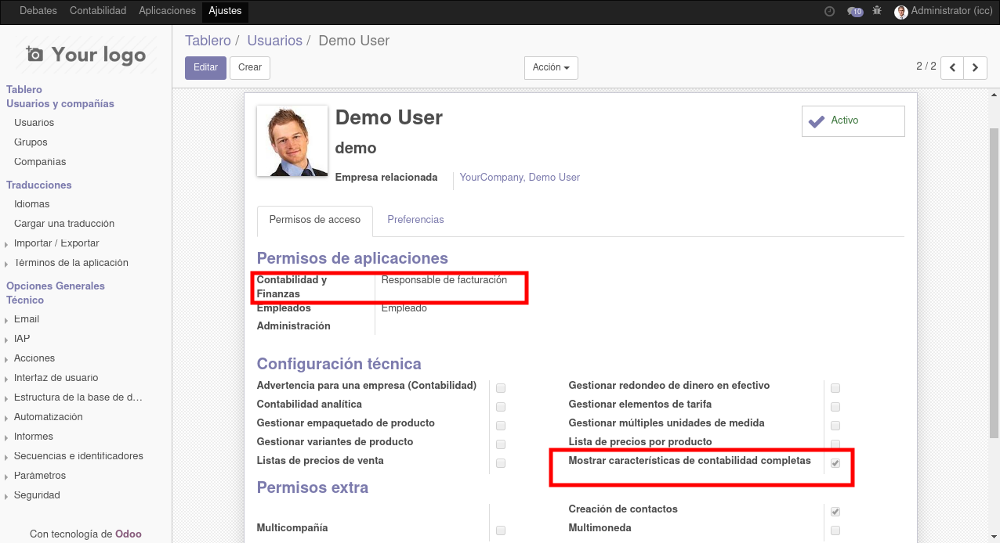

# DECLARA SAT

## Flujo de declaracion

1. Se genera el reporte de DIOT 
2. Se envia una la solicitud 
3. Se genera el comprobante de pago 
4. Se Adjunto el tiket de pago -> Si no se hace el pago Se genera otro comprobante de pago que incluyen recargos por la inpuntualidad.

## Manejar de Acciones 

1. Desde el estatus DRAFT podra "GENERAR DIOT y ACUSE DE RECIBO"
2. Desde el estatus DIOT podra "GENERAR ACUSE DE RECIBO"
3. Desde el estatus A. RECIBO podra "GENERAR FORMATO DE PAGO"
4. Desde el estatus F. PAGO podra "GENERAR COMPROBANTE DE PAGO"
5. Desde el estatus C. PAGO podra "GENERAR RE-GENERAR FORMATO DE PAGO y FINALIZAR LA DECLARACION"

## Control de accesso
Nombre tecnico del grupo (account.group_account_manager)
que puede gestionar el flujo de la declaracion.

